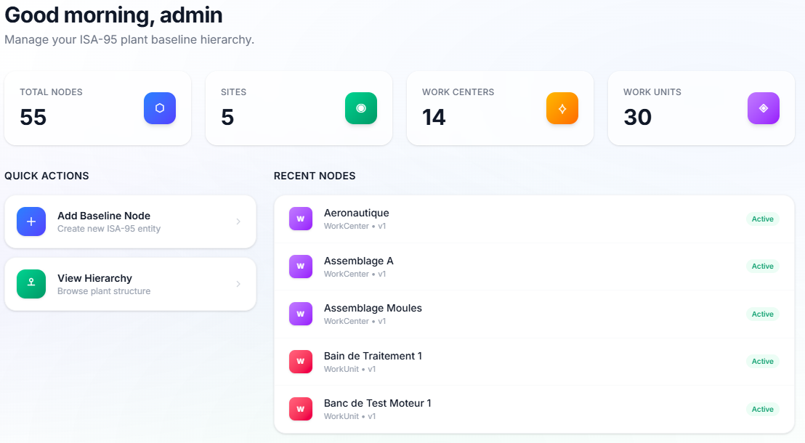
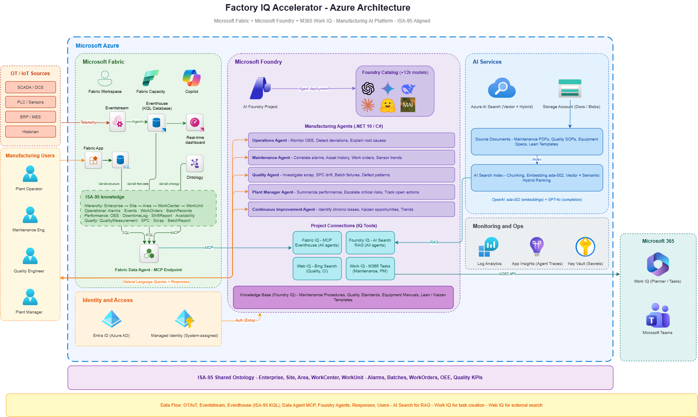
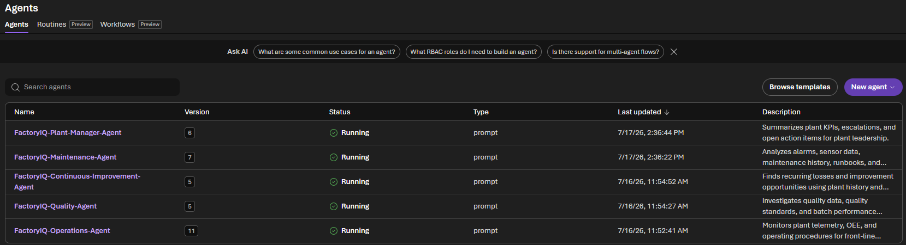

<div align="center">

# 🏭 Factory IQ Accelerator

### Industrial AI Platform — from raw Azure subscription to live manufacturing agents in one deploy.

<br/>

[](LICENSE)
[](infra/terraform/)
[](https://learn.microsoft.com/fabric)
[](https://ai.azure.com)
[](src/foundry-agents/)
[](shared/isa95-model/)

<br/>

[**Quick Start**](#-quick-start) · [**Architecture**](#-architecture) · [**Agents**](#-manufacturing-agents) · [**IaC**](#-iac-deployment-terraform) · [**Docs**](#-documentation)

</div>

---

## The Problem

Manufacturing plants generate enormous volumes of operational data — KPIs, alarms, sensor readings, work orders — but it sits in silos, disconnected from the people who need it to make decisions.

Standing up the full data and AI stack (data platform, ontology, telemetry pipeline, AI agents) takes months, requires deep expertise in multiple technologies, and still ends up inconsistent across plants.

**Factory IQ Accelerator** solves this by providing a fully wired, opinionated, deployment-ready baseline that any team can stamp onto a new plant in minutes.

---

## What It Does

<div align="center">

</div>

<br/>

In a single deploy, Factory IQ Accelerator provisions:

| Layer | What Gets Built |
|-------|----------------|
| 🏭 **Data Foundation** | Microsoft Fabric capacity, workspace, Eventhouse, KQL database, Eventstream |
| 📊 **Real-Time Monitoring** | Fabric KQL Queryset + KQL Dashboard bootstrap for machine performance verification |
| 📐 **Domain Model** | ISA-95-aligned KQL tables, update policies, and plant hierarchy seeding |
| 🔍 **Search & Knowledge** | Azure AI Search, knowledge base, vector index over maintenance/quality docs |
| 🤖 **AI Agents** | 5 manufacturing agents on Azure AI Foundry (C#/.NET 10) |
| 🔗 **Live Connectors** | Fabric Data Agent (MCP, optionally ontology-enriched), Work IQ (M365 tasks), Foundry IQ (RAG) |
| 📄 **Handoff Contract** | `connection.json` — deployment output contract for downstream tools |

---

## Architecture

<!-- Architecture diagram — open docs/assets/factory-iq-architecture.drawio in draw.io -->
<div align="center">

</div>

---

## Manufacturing Agents

Five production-ready agents, each covering a distinct manufacturing domain:

<!-- Agents screenshot -->
<div align="center">

</div>

<br/>

| Agent | Role | Tools |
|-------|------|-------|
| ⚙️ **Operations** | Monitor OEE, detect performance deviations, explain root causes | Fabric Data Agent (KQL + Ontology source) · Foundry IQ KB |
| 🔧 **Maintenance** | Correlate alarms, asset history, sensor trends; recommend corrective actions | Fabric Data Agent (KQL + Ontology source) · Foundry IQ KB · **Work IQ** |
| 🔬 **Quality** | Investigate scrap, SPC drift, batch failures, defect patterns | Fabric Data Agent (KQL + Ontology source) · Foundry IQ KB · Web IQ |
| 🏢 **Plant Manager** | Summarize plant performance, escalate critical risks, track open actions | Fabric Data Agent (KQL + Ontology source) · Foundry IQ KB · **Work IQ** |
| 🔁 **Continuous Improvement** | Identify chronic losses, kaizen opportunities, improvement trends | Fabric Data Agent (KQL + Ontology source) · Foundry IQ KB · Web IQ |

Agents are registered as **versioned Foundry Agents** and stay persistent in the portal between runs.

---

## Connectors & IQ Sources

<!-- PLACEHOLDER: Connector diagram -->
<!-- Image: docs/assets/connectors-diagram.png -->
<!-- Specs: 900×300px, horizontal flow with 4 connector boxes and arrows pointing to "Agents" hub in center -->
<!-- Content: left-to-right: [Fabric Data Agent] → [Agents Hub] ← [Foundry IQ / AI Search] ← [Work IQ] ← [Web IQ] -->

| Connector | Technology | Used By |
|-----------|-----------|---------|
| **Fabric IQ** | Fabric Data Agent MCP — live KQL queries on Eventhouse | All agents |
| **Foundry IQ** | Azure AI Search — RAG over maintenance procedures, quality standards, lean templates | All agents |
| **Work IQ** | Microsoft 365 work management (Planner, Tasks) | Maintenance · Plant Manager |
| **Web IQ** | Bing / web search for benchmarks and supplier specs | Quality · Continuous Improvement |

---

> Ontology integration pattern: add Ontology as a source inside the Fabric Data Agent, then keep Foundry connected to the Data Agent MCP endpoint.

## IaC Deployment (Terraform)

```bash
terraform -chdir=infra/terraform init
terraform -chdir=infra/terraform apply \
  -var-file=environments/dev.tfvars
terraform -chdir=infra/terraform output \
  -json connection_contract > connection.json
```

---

## 🚀 Quick Start

### 1. Prerequisites

- Azure CLI authenticated (`az login`)
- Owner access on target subscription
- .NET 10 SDK (for Foundry agents)
- Python 3.11+ (for ISA-95 model scripts)
- Terraform ≥ 1.6

### 2. Set context

```bash
export PLANT_CODE="plant1"
export ENVIRONMENT="dev"
export REGION="westeurope"
export RESOURCE_GROUP="rg-fiq-${PLANT_CODE}-${ENVIRONMENT}"
```

### 3. Deploy infrastructure

```bash
# Terraform path
terraform -chdir=infra/terraform init
terraform -chdir=infra/terraform apply -var-file=environments/dev.tfvars -auto-approve
terraform -chdir=infra/terraform output -json connection_contract > connection.json
```

### 4. (Optional) Deploy ISA-95 model

Skip this step if you only want to validate infrastructure + agent wiring. Run it when you want the ISA-95 schema/hierarchy baseline deployed to Fabric.

```bash
python shared/scripts/deploy-model.py \
  --connection ./connection.json \
  --core-dir ./shared/isa95-model/core \
  --extensions-dir ./shared/isa95-model/extensions \
  --hierarchy-config ./shared/isa95-model/config/plant-hierarchy.yaml
```

### 5. Run an agent

```bash
export PROJECT_ENDPOINT="<from connection.json: foundryProjectEndpoint>"
export FOUNDRY_FABRIC_DATA_AGENT_PROJECT_CONNECTION_NAME="fabric-iq-data-agent-connection"

dotnet run --project src/foundry-agents/agents/FactoryIQ.Agents.Maintenance \
  -- "Show me the top 5 open alarms for line 1"
```

<!-- PLACEHOLDER: Quick start terminal recording -->
<!-- Image: docs/assets/quickstart-terminal.gif or .png -->
<!-- Specs: 1200×500px, dark terminal theme (Dracula / Tokyo Night) -->
<!-- Content: Animated GIF OR static screenshot of `dotnet run` output showing agent response with cited sources -->

---

## Repo Structure

```
factory-iq-accelerator/
├── infra/
│   └── terraform/          # Terraform: Fabric + Foundry + AI Search + Storage
├── src/
│   ├── foundry-agents/     # .NET 10 — 5 AI manufacturing agents
│   │   ├── shared/         # FoundryAgentBase, AgentRunner, FoundryConfig
│   │   ├── agents/         # Operations · Maintenance · Quality · PlantManager · CI
│   │   └── knowledge/      # Sample docs for Foundry IQ (maintenance, quality, lean)
│   └── fabric-apps/        # Fabric workspace application
├── shared/
│   └── isa95-model/        # ISA-95 KQL schema, update policies, hierarchy YAML
├── contracts/              # connection.json schema + model runner interface
└── docs/                   # Architecture, Foundry agent integration guide
```

---

## Connection Contract

Terraform emits `connection.json`, which is used by downstream tools:

```json
{
  "tenantId": "...",
  "subscriptionId": "...",
  "resourceGroup": "rg-fiq-plant1-dev",
  "region": "westeurope",
  "workspaceId": "...",
  "eventhouseId": "...",
  "kqlDatabase": "fiq-plant1-dev-kql",
  "foundryProjectEndpoint": "https://...",
  "foundryIqProjectConnectionName": "foundry-iq-kb-connection",
  "foundryFabricProjectConnectionName": "fabric-iq-data-agent-connection",
  "foundryWorkIqProjectConnectionName": "work-iq-connection",
  "aiSearchEndpoint": "https://...",
  "modelDeploymentName": "gpt-4o",
  "schemaVersion": "3.0"
}
```

> The contract is stable and consumed by downstream tooling (`shared/scripts/deploy-model.py`, agent setup), independently of deployment internals.

---

## Customization

No forking needed. Use these files as your customization surface:

| File | What To Change |
|------|---------------|
| `shared/isa95-model/config/plant-hierarchy.yaml` | Enterprise → Site → Area → WorkCenter → WorkUnit definitions |
| `shared/isa95-model/extensions/*.kql` | Customer-specific schema, functions, policies |
| `shared/eventstream/definition/eventstream.json` | Telemetry ingestion topology |
| `infra/terraform/environments/*` | Plant code, region, SKU, optional feature flags |
| `src/foundry-agents/knowledge/` | Maintenance procedures, quality standards, lean templates |

**Rule:** Keep `shared/isa95-model/core/` unchanged. All customer-specific schema goes in `extensions/`.

---

## Documentation

| Document | Description |
|----------|-------------|
| [Architecture](docs/architecture.md) | Platform architecture, design decisions |
| [Foundry Agents](docs/foundry-agents.md) | Agent integration guide, connectors, RBAC |
| [Connection Contract](contracts/connection-contract.md) | Schema reference for `connection.json` |
| [Terraform README](infra/terraform/README.md) | Terraform-specific deployment guide |
| [ISA-95 Model](shared/isa95-model/README.md) | Model schema, hierarchy, extension guide |
| [Fabric Ontology](docs/fabric-ontology.md) | Ontology design + Data Agent integration pattern |
| [Foundry Agents (src)](src/foundry-agents/README.md) | Agent developer guide, env vars, local run |

---

## Tech Stack

| Technology | Role |
|------------|------|
| [Microsoft Fabric](https://learn.microsoft.com/fabric) | Real-time operational data platform |
| [Azure AI Foundry](https://ai.azure.com) | Agent hosting, connections, versioning |
| [Azure OpenAI (GPT-4o)](https://learn.microsoft.com/azure/ai-services/openai/) | Agent reasoning and response generation |
| [Azure AI Search](https://learn.microsoft.com/azure/search/) | Foundry IQ vector / hybrid search |
| [.NET 10 / C#](https://dotnet.microsoft.com) | Agent runtime |
| [Microsoft Agent Framework](https://github.com/microsoft/agents) | Agent orchestration SDK |
| [Terraform](https://www.terraform.io) + [Fabric Provider](https://registry.terraform.io/providers/microsoft/fabric) | IaC engine |
| [ISA-95](https://www.isa.org/standards-and-publications/isa-standards/isa-standards-committees/isa95) | Manufacturing ontology standard |

---

## Current Limitations & Preview Notes

- Agent runtime currently depends on prerelease SDKs: `Azure.AI.Projects` (`2.1.0-beta.4`) and `Microsoft.Agents.AI.Foundry` (`1.13.0-preview.260703.1`).
- Foundry project connections for Fabric IQ and Work IQ use preview connector types (`fabric_iq_preview`, `work_iq_preview`) and can evolve with Foundry updates.
- Foundry IQ knowledge base MCP endpoint currently uses a preview API version (`2026-05-01-preview`).
- Work IQ integration is optional and tenant-dependent (connection target, permissions, and M365 availability must be provided by the customer tenant).
- Fabric Data Agent endpoint can be region/tenant specific; in some environments you must provide the exact portal-discovered MCP target URL.

---

<div align="center">

Built with ❤️ for manufacturing teams by Microsoft.

<!-- PLACEHOLDER: Microsoft logo or "Made with Azure" badge -->
<!-- Image: docs/assets/made-with-azure.svg -->
<!-- Specs: 200×48px SVG, use the official "Built on Azure" badge SVG from microsoft.com/azure/certifications -->

</div>
