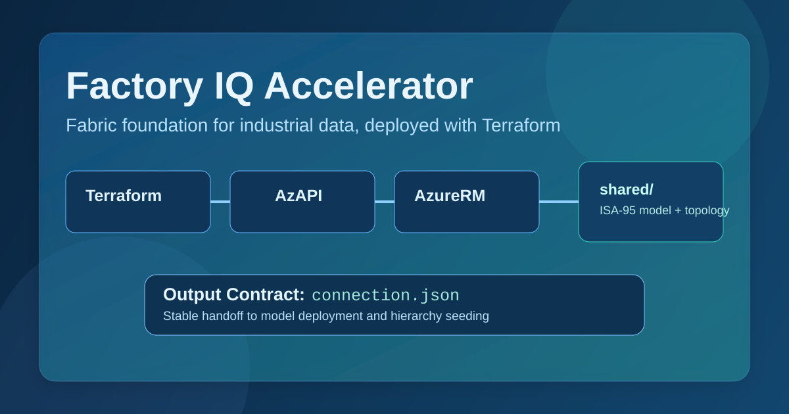

# Factory IQ Accelerator



Build an industrial-grade Microsoft Fabric foundation in minutes, not weeks.

This accelerator is a deployment-ready baseline for industrial data platforms on Microsoft Fabric. It standardizes how a plant foundation is deployed, modeled, and handed off to data/model operations teams.

At a high level, the accelerator does four things:

1. Provisions the Fabric foundation for one plant: capacity, workspace, eventhouse, KQL database, and eventstream.
2. Keeps infrastructure engine choice flexible: Terraform, Bicep, or Pulumi.
3. Centralizes domain model assets in one shared location aligned to ISA-95.
4. Produces a stable output contract, `connection.json`, so model deployment is engine-blind.

Core operating principles:

- one stack per plant
- ISA-95-aligned model foundation
- three interchangeable IaC engines
- one stable handoff contract (connection.json)

## What You Get (v1)

- Fabric capacity (default `F2`, parameterized)
- One workspace per plant
- Eventhouse + KQL database
- Eventstream baseline topology
- ISA-95 core model scripts and update policies
- Model deployment + hierarchy seeding scripts

## Repo Tour

```text
infra/
	terraform/            # Native Fabric-provider baseline
	bicep/                # ARM + deploymentScript path
	pulumi/               # TypeScript componentized path

shared/
	isa95-model/
		core/               # Project-owned baseline model
		extensions/         # Customer-owned custom entities
		config/             # Plant hierarchy YAML
	eventstream/
	scripts/

contracts/              # Handoff and runner interface
docs/                   # Architecture and validation guidance
```

## Choose Your Engine

Pick **exactly one** engine under `infra/` for deployment. You can remove the other two and still have a complete stack.

- Terraform
- Bicep
- Pulumi

## How To Deploy

### 1) Prerequisites

- Azure CLI installed and authenticated
- Access to target subscription/resource group
- One selected IaC engine: Terraform, Bicep, or Pulumi
- Python 3.11+ for model deployment scripts

### 2) Define deployment context

Use these values consistently across infra + model deployment:

- plantCode
- environment
- region
- capacitySku (default F2)

Example bash variables:

```bash
export PLANT_CODE="plant1"
export ENVIRONMENT="dev"
export REGION="westeurope"
export CAPACITY_SKU="F2"
export RESOURCE_GROUP="rg-fiq-plant1-dev"
```

### 3) Authenticate

Interactive login:

```bash
az login
az account set --subscription "<subscription-id-or-name>"
```

Service principal login:

```bash
az login --service-principal \
	--username "<app-id>" \
	--password "<client-secret>" \
	--tenant "<tenant-id>"
```

### 4) Deploy with your chosen engine

#### Terraform

```bash
terraform -chdir=infra/terraform init
terraform -chdir=infra/terraform plan -var-file=environments/dev.tfvars
terraform -chdir=infra/terraform apply -var-file=environments/dev.tfvars
terraform -chdir=infra/terraform output -json connection_contract > connection.json
```

#### Bicep

```bash
az deployment group create \
	--resource-group "$RESOURCE_GROUP" \
	--template-file infra/bicep/main.bicep \
	--parameters infra/bicep/environments/dev.bicepparam

az deployment group show \
	--resource-group "$RESOURCE_GROUP" \
	--name main \
	--query properties.outputs.connectionContract.value \
	--output json > connection.json
```

#### Pulumi

```bash
pulumi -C infra/pulumi stack init dev
pulumi -C infra/pulumi config set plantCode "$PLANT_CODE"
pulumi -C infra/pulumi config set environment "$ENVIRONMENT"
pulumi -C infra/pulumi config set region "$REGION"
pulumi -C infra/pulumi config set capacitySku "$CAPACITY_SKU"
pulumi -C infra/pulumi up
pulumi -C infra/pulumi stack output connectionContract > connection.json
```

### 5) Validate connection contract

```bash
jq -e '.tenantId and .subscriptionId and .resourceGroup and .region and .workspaceId and .eventhouseId and .kqlDatabase and .generatedAt and .schemaVersion' connection.json
jq -e '.schemaVersion == "1.0"' connection.json
```

### 6) Deploy ISA-95 model and hierarchy

```bash
python shared/scripts/seed-hierarchy.py --config shared/isa95-model/config/plant-hierarchy.yaml

python shared/scripts/deploy-model.py \
	--connection ./connection.json \
	--core-dir ./shared/isa95-model/core \
	--extensions-dir ./shared/isa95-model/extensions \
	--hierarchy-config ./shared/isa95-model/config/plant-hierarchy.yaml
```

### 7) Re-run to confirm idempotency

```bash
python shared/scripts/deploy-model.py \
	--connection ./connection.json \
	--core-dir ./shared/isa95-model/core \
	--extensions-dir ./shared/isa95-model/extensions \
	--hierarchy-config ./shared/isa95-model/config/plant-hierarchy.yaml
```

Expected result: no unintended duplicate resources or schema objects.

## Contract Snapshot

Every engine must emit the same handoff artifact:

```json
{
	"tenantId": "...",
	"subscriptionId": "...",
	"resourceGroup": "...",
	"region": "...",
	"workspaceId": "...",
	"eventhouseId": "...",
	"kqlDatabase": "...",
	"generatedAt": "...",
	"schemaVersion": "1.0"
}
```

Canonical contract: `contracts/connection-contract.md`

## Customization Without Forking

Use these files as your customization surface.

| File | What To Change | Operational Impact |
|---|---|---|
| `shared/isa95-model/config/plant-hierarchy.yaml` | Update enterprise/site/area/workCenter/workUnit definitions and IDs | Changes seeded hierarchy in KQL dimensions; affects downstream joins, dashboards, and equipment mapping |
| `shared/isa95-model/extensions/*.kql` | Add customer entities/functions/policies using numeric prefixes (for example `30_*`, `40_*`) | Adds plant/customer-specific model capabilities without touching core; applied after core on each run |
| `shared/eventstream/definition/eventstream.json` | Adjust input/output topology and routing | Changes telemetry ingestion path into Eventhouse landing tables |
| `infra/<engine>/environments/*` or Pulumi config | Adjust plant/environment/region/SKU parameters | Changes deployment naming, target region, and scale footprint |

Recommended customization rules:

1. Keep `shared/isa95-model/core/` unchanged unless you are intentionally changing product baseline behavior.
2. Put all customer-specific schema in `extensions/` so upgrades remain clean.
3. Keep IDs stable in hierarchy YAML once data consumers depend on them.
4. Re-run model deployment after each customization and validate with representative queries.

Quick examples:

```bash
# Add extension file and deploy
cp shared/isa95-model/extensions/30_sample_tool_entity.kql shared/isa95-model/extensions/31_my_extension.kql
python shared/scripts/deploy-model.py \
	--connection ./connection.json \
	--core-dir ./shared/isa95-model/core \
	--extensions-dir ./shared/isa95-model/extensions \
	--hierarchy-config ./shared/isa95-model/config/plant-hierarchy.yaml

# Edit hierarchy then reseed/validate
python shared/scripts/seed-hierarchy.py --config shared/isa95-model/config/plant-hierarchy.yaml
```

## Validation Checklist

- contract fields present and valid
- equivalent logical resources across engines
- deterministic naming (`fiq-{plant}-{env}-{resource}`)
- successful second run with no unintended duplicates

## Next Steps

- Start with the engine README in your chosen folder under `infra/`
- Follow full runbook in `specs/001-fabric-foundation/quickstart.md`
- Review architecture constraints in `docs/architecture.md`
